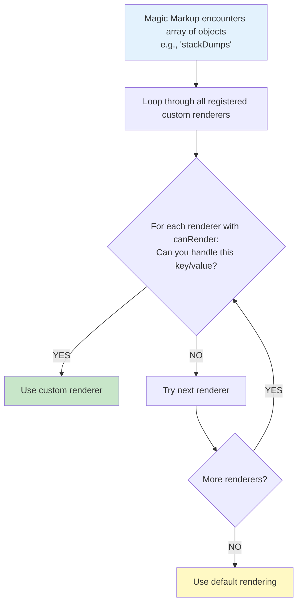

# Custom Renderers Guide

## 📚 Table of Contents

1. [Overview](#overview)
2. [Architecture](#architecture)
3. [Quick Start](#quick-start)
4. [Renderer API Reference](#renderer-api-reference)
5. [Step-by-Step Guide](#step-by-step-guide)
6. [Real-World Examples](#real-world-examples)
7. [Utility Functions](#utility-functions)
8. [Best Practices](#best-practices)
9. [Troubleshooting](#troubleshooting)

---

## Overview

Custom renderers allow you to extend Magic Markup's rendering capabilities by creating specialized visualizations for specific data types. Instead of using the default table/card views, you can create custom HTML representations tailored to your data.

### Why Use Custom Renderers?

- **Specialized Visualizations**: Create domain-specific views (thread dumps, timelines, charts, etc.)
- **Dynamic Detection**: Automatically apply renderers based on data structure
- **Reusable Components**: Write once, use across multiple projects
- **Full Control**: Complete control over HTML, CSS, and JavaScript
- **Easy Integration**: Simple API with minimal boilerplate

### Key Features

✅ **Dynamic Detection** - Renderers auto-detect when they should be used  
✅ **Lifecycle Hooks** - `onMount` for post-render initialization  
✅ **Custom Styling** - Inject CSS automatically  
✅ **Utility Access** - Use Magic Markup's built-in helper functions  
✅ **Fallback Support** - Gracefully falls back to default rendering  

---

## Architecture

### How It Works

### How It Works



### Registration Flow

1. **Create Renderer** - Define renderer object with `canRender()` and `render()` methods
2. **Register** - Call `magicMarkup.registerRenderer('name', renderer)`
3. **Auto-Inject Styles** - CSS is automatically injected if provided
4. **Auto-Detection** - Renderer is checked for every array of objects
5. **Render** - If `canRender()` returns true, `render()` is called

---

## Quick Start

### 5-Minute Example

Let's create a simple custom renderer for displaying a list of events as a timeline.

#### Step 1: Create the Renderer

```javascript
const TimelineRenderer = {
    // Check if this renderer should handle the data
    canRender(key, value) {
        return key === 'events' && Array.isArray(value);
    },
    
    // Render the custom HTML
    render(key, value, label, utils) {
        const container = document.createElement('div');
        container.className = 'timeline-container';
        
        value.forEach(event => {
            const item = document.createElement('div');
            item.className = 'timeline-item';
            item.innerHTML = `
                <div class="timeline-marker"></div>
                <div class="timeline-content">
                    <h4>${event.title}</h4>
                    <p class="timeline-time">${event.timestamp}</p>
                    <p>${event.description}</p>
                </div>
            `;
            container.appendChild(item);
        });
        
        return container;
    },
    
    // Optional: Provide custom CSS
    getStyles() {
        return `
            .timeline-container {
                position: relative;
                padding-left: 30px;
            }
            .timeline-item {
                position: relative;
                padding-bottom: 20px;
                border-left: 2px solid #e0e0e0;
            }
            .timeline-marker {
                position: absolute;
                left: -6px;
                width: 10px;
                height: 10px;
                border-radius: 50%;
                background: #2196F3;
            }
            .timeline-content {
                padding-left: 20px;
            }
            .timeline-time {
                color: #666;
                font-size: 0.9em;
            }
        `;
    }
};
```

#### Step 2: Register the Renderer

```js
const magicMarkup = new MagicMarkup('#container');

// Register the custom renderer
magicMarkup.registerRenderer('timeline', TimelineRenderer);

// Render your data
magicMarkup.render({
    events: [
        { title: 'Project Started', timestamp: '2024-01-01', description: 'Initial commit' },
        { title: 'First Release', timestamp: '2024-02-15', description: 'Version 1.0.0' },
        { title: 'Major Update', timestamp: '2024-03-20', description: 'Version 2.0.0' }
    ]
});
```

#### HTML Integration Example

```html
<!DOCTYPE html>
<html>
<head>
    <link rel="stylesheet" href="src/magic-markup.css">
</head>
<body>
    <div id="app"></div>
    
    <script src="src/magic-markup.js"></script>
    <script src="src/renderers/timeline-renderer.js"></script>
    
    <script>
        const mm = new MagicMarkup('#app');
        mm.registerRenderer('timeline', TimelineRenderer);
        mm.render('data/events.json');
    </script>
</body>
</html>
```


---

## Renderer API Reference

### Renderer Object Structure

A custom renderer is a JavaScript object with the following properties:

```javascript
const MyRenderer = {
    name: 'my-renderer',           // Optional: Renderer name
    version: '1.0.0',               // Optional: Version
    
    canRender(key, value) { },      // Required: Detection logic
    render(key, value, label, utils) { }, // Required: Rendering logic
    
    getStyles() { },                // Optional: Custom CSS
    onMount(element, value) { }     // Optional: Post-render hook
};
```

---

### Required Methods

#### `canRender(key, value)`

Determines whether this renderer should handle the given data.

**Parameters:**
- `key` (string): The property key from the JSON data
- `value` (any): The property value

**Returns:** `boolean` - `true` if this renderer should handle the data

**Examples:**

```javascript
// Match by exact key name
canRender(key, value) {
    return key === 'stackDumps' && Array.isArray(value);
}

// Match by key pattern
canRender(key, value) {
    return key.endsWith('Timeline') && Array.isArray(value);
}

// Match by value structure
canRender(key, value) {
    return Array.isArray(value) && 
           value.length > 0 && 
           value[0].hasOwnProperty('timestamp');
}
```

---

#### `render(key, value, label, utils)`

Creates and returns the custom HTML element.

**Parameters:**
- `key` (string): The property key
- `value` (any): The property value (usually an array)
- `label` (string): Formatted label
- `utils` (object): Utility functions from Magic Markup

**Returns:** `HTMLElement` - The rendered DOM element

---

### Optional Methods

#### `getStyles()`

Returns CSS string to be injected into the document.

#### `onMount(element, value)`

Lifecycle hook called after the element is added to the DOM.

---

### Utility Functions

The `utils` object provides helper functions:

- `utils.formatLabel(key)` - Format keys to labels
- `utils.applyValueHighlighting(element, value)` - Apply CSS highlighting
- `utils.detectValueType(value)` - Detect value types
- `utils.createAccordion(title, content)` - Create accordion sections
- `utils.isShortAndFew(strings)` - Check if suitable for badges
- `utils.getKeyConfig(key)` - Get configuration options
- `utils.filterFields(obj, config)` - Filter object fields
- `utils.applyTransform(value, key, config)` - Apply transformations
- `utils.shouldHighlight(key, config)` - Check highlighting rules

---

### Registration Methods

```javascript
// Register a renderer
magicMarkup.registerRenderer('myRenderer', MyRenderer);

// Unregister a renderer
magicMarkup.unregisterRenderer('myRenderer');
```

---

## Step-by-Step Guide

### Creating a Chart Renderer

__Step 1: Define the Structure__

```javascript
const ChartRenderer = {
    canRender(key, value) {
        return key === 'metrics' && 
               Array.isArray(value) &&
               value.every(v => v.value && v.label);
    }
};
```
__Step 2: Implement Rendering__

```javascript
render(key, value, label, utils) {
    const container = document.createElement('div');
    container.className = 'chart-container';
    
    const canvas = document.createElement('canvas');
    canvas.id = 'chart-' + Date.now();
    container.appendChild(canvas);
    
    return container;
}
```
__Step 3: Add Lifecycle Hook__

```javascript
onMount(element, value) {
    const canvas = element.querySelector('canvas');
    new Chart(canvas, {
        type: 'bar',
        data: {
            labels: value.map(v => v.label),
            datasets: [{
                data: value.map(v => v.value),
                backgroundColor: '#2196F3'
            }]
        }
    });
}
```

__Step 4: Add Styles__

```javascript
getStyles() {
    return `
        .chart-container {
            padding: 20px;
            background: white;
            border-radius: 8px;
        }
    `;
}
```

## Real-World Examples

### Example 1: Thread Dump Renderer (Existing)

See `src/renderers/thread-dump-renderer.js` for a complete example.

### Example 2: Status Badge Renderer

```javascript
const StatusRenderer = {
    canRender(key, value) {
        return key === 'statuses' && Array.isArray(value);
    },
    
    render(key, value, label, utils) {
        const container = document.createElement('div');
        container.className = 'status-badges';
        
        value.forEach(status => {
            const badge = document.createElement('span');
            badge.className = 'status-badge';
            badge.textContent = status.name;
            badge.dataset.status = status.state;
            utils.applyValueHighlighting(badge, status.state);
            container.appendChild(badge);
        });
        
        return container;
    },
    
    getStyles() {
        return `
            .status-badges {
                display: flex;
                gap: 8px;
                flex-wrap: wrap;
            }
            .status-badge {
                padding: 4px 12px;
                border-radius: 12px;
                font-size: 0.85em;
            }
        `;
    }
};

```

## Best Practices

1. __Always validate data__ in `canRender()`
2. __Use semantic HTML__ in `render()`
3. __Scope CSS classes__ to avoid conflicts
4. __Handle edge cases__ (empty arrays, null values)
5. __Use utils functions__ for consistency
6. __Document your renderer__ with comments
7. __Test with various data__ structures
8. __Keep renderers focused__ on one responsibility

---

## Troubleshooting

__Q: My renderer isn't being called__

- Check `canRender()` logic
- Verify renderer is registered
- Check console for errors

__Q: Styles not applying__

- Ensure `getStyles()` returns a string
- Check for CSS syntax errors
- Verify class names match

__Q: onMount not firing__

- Element must be in DOM
- Check for JavaScript errors
- Verify method name spelling

---

## Summary

Custom renderers provide a powerful way to extend Magic Markup:

1. Create renderer with `canRender()` and `render()`
2. Register with `registerRenderer()`
3. Optionally add `getStyles()` and `onMount()`
4. Use utility functions for consistency
5. Follow best practices for maintainability

For more examples, see the `src/renderers/` directory.
